圣经相关的符号和象征

在教会传统中，许多日常可见的事物都承载着象征和寓意。从各种十字架到节日庆典，这些符号如同一部无声的百科全书，诉说着信仰的故事。今天，让我们一起走进这个充满象征意义的暗号世界。

理解这些符号的含义，有助于我们更好地欣赏宗教艺术，理解西方文化传统，也能让我们在面对这些符号时，感受到其背后蕴含的深刻人文精神和对美好未来的永恒向往。

无论我们的信仰如何，这些符号都在提醒我们：在人类的精神世界中，总有一些超越物质的追求，指引着我们寻找生命的意义和价值。

## 十字架：最核心的标识

十字架无疑是基督教最重要的符号。它不仅代表耶稣基督的受难与牺牲，更象征着救赎、希望和永生。

**不同形式的十字架：**

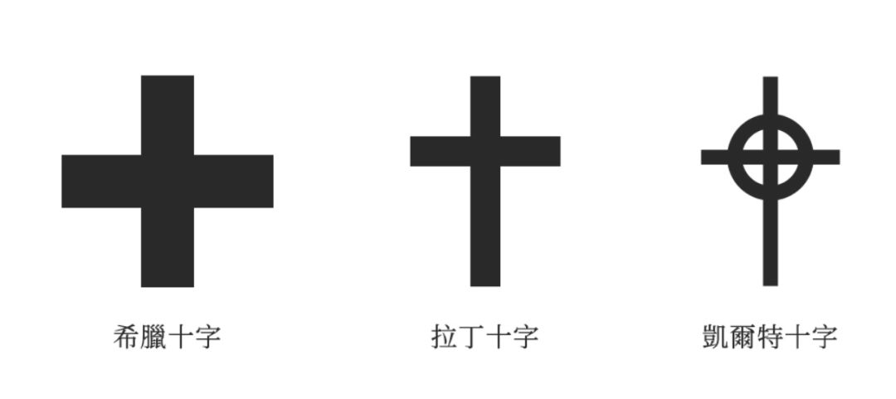

**拉丁十字架**：竖直的长臂和较短的横臂，是最常见的形式，直接对应基督受难时的十字架形状。天主教会广泛使用这种形式。

**希腊十字架**：四臂等长，象征着平衡与和谐，在东正教传统中更为常见。其对称性代表了神性的完美。

**凯尔特十字架**：在传统十字架基础上加入圆环，圆环代表永恒，体现了早期爱尔兰基督教的特色。

**基督十字**

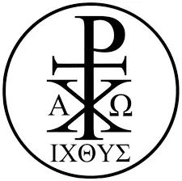

这是**基督教"基督十字"符号**（Chi-Rho），也被称为**君士坦丁十字**或**胜利十字**。

## 符号构成与含义

**核心元素：**

- **P和X的组合**
    
    ：这是希腊文"基督"（ΧΡΙΣΤΟΣ，Christos）的前两个字母Χ和Ρ。字母X读作“忾”（同仇敌忾的忾），对应英文字母CH。字母P读作“肉”，对应英文字母R。所以XP和起来对应英文的基督CHRIST的前三个字母CHR。
    
- **Alpha和Omega（Α Ω）**
    
    ：分别是希腊字母表的第一个和最后一个字母
    
- **ΙΧΘΥΣ**
    
    ：希腊文"鱼"，是早期基督教暗号
    

## 圣经根据

**启示录的预言**（启示录1:8，21:6，22:13）：耶稣说"我是阿拉法，我是俄梅戛；我是首先的，我是末后的；我是初，我是终。"Alpha和Omega正对应这一宣告。

**君士坦丁大帝的异象**：公元312年，罗马皇帝君士坦丁在米尔维安桥战役前看到天空中出现这个符号，并听到声音说"靠此征服"（In Hoc Signo Vinces）。他将此符号绘在军旗上，赢得了关键胜利，随后颁布《米兰敕令》，让基督教在罗马帝国合法化。

**早期教会的使用**：这个符号比十字架更早被基督徒广泛使用，因为在迫害时期，它不像十字架那样明显，但对信徒来说意义明确。

## 现代应用

今天，这个符号仍然出现在许多教会的装饰、圣餐用具、牧师法衣上，特别是在天主教和东正教传统中较为常见。它代表了基督的神性、永恒性，以及基督教从受迫害转向胜利的历史转折点。

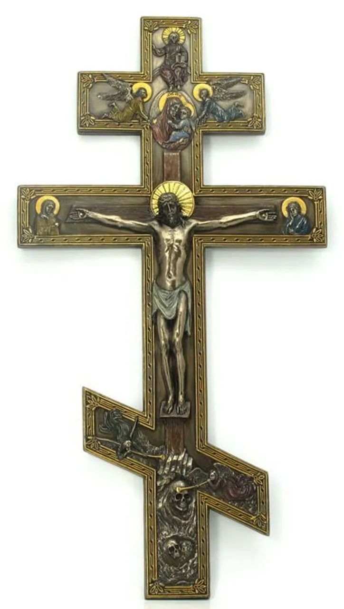

**东正教十字架**

具有三根横臂，顶部较短的横臂代表钉在耶稣头顶的标牌写着“犹太人的王”（约翰福音19:19），中间的横臂是耶稣被钉的地方（路加福音23:33），底部倾斜的横臂象征着信和不信盗贼的不同归宿（路加福音23:39-43）。

**耶路撒冷十字架**：由一个大十字和四个小十字构成，历史上与十字军东征相关。四个小十字可象征四福音书，也可代表福音传向世界四方。整体设计体现了中世纪基督教的宗教热忱。

**教派间的差异：**

- **天主教**
    
    ：多用拉丁十字架，常有受难的基督像（苦像）
    
- **东正教**
    
    ：偏爱希腊十字架和三臂十字架，强调基督的荣耀复活
    
- **新教**
    
    ：通常使用简洁的空十字架，强调基督已经复活
    

## 鱼：早期教徒的暗号

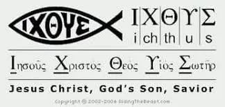

鱼形符号（Ichthys）在早期基督教历史中具有特殊意义。希腊文"鱼"（ΙΧΘΥΣ）的每个字母恰好构成了一句完整的信仰宣言：

- **Ι (Iota)**
    
     - Ἰησοῦς (Iesous) = 耶稣
    
- **Χ (Chi)**
    
     - Χριστός (Christos) = 基督
    
- **Θ (Theta)**
    
     - Θεοῦ (Theou) = 神的
    
- **Υ (Upsilon)**
    
     - Υἱός (Huios) = 儿子
    
- **Σ (Sigma)**
    
     - Σωτήρ (Soter) = 救世主
    

连起来就是"耶稣基督，神的儿子，救世主"。在罗马帝国迫害基督徒的时期，信徒们用这个看似无害的鱼形符号作为秘密标识，既能相互识别，又不会引起当局注意。

鱼的象征意义还源于多个圣经故事：耶稣呼召渔夫彼得和安德烈成为"得人如得鱼"的使徒；五饼二鱼的神迹；复活后的耶稣与门徒在海边分享烤鱼等。

### 锚：希望的象征

锚在早期基督教艺术中常常出现，特别是在罗马地下墓穴的壁画中。

**圣经根据：**希伯来书6:19："我们有这指望，如同灵魂的锚，又坚固、又牢靠，且通入幔内。"

保罗的海难经历（使徒行传27:29）：在前往罗马的海上旅程中，船员"从船尾抛下四个锚"，锚成了在绝望中的希望象征。

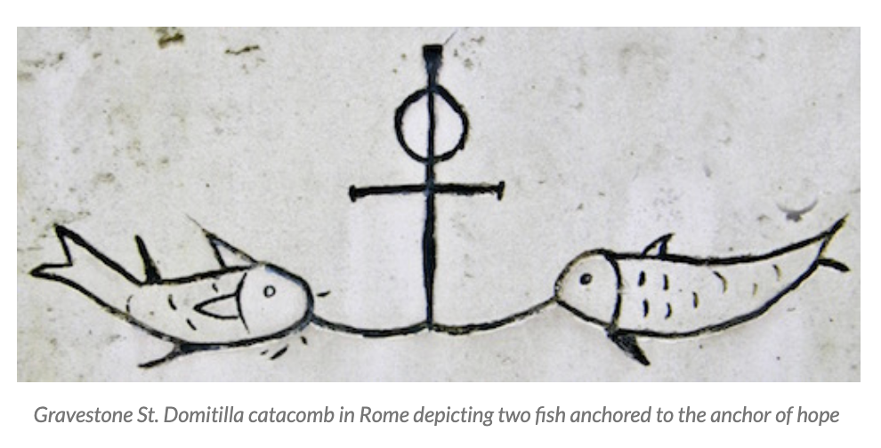

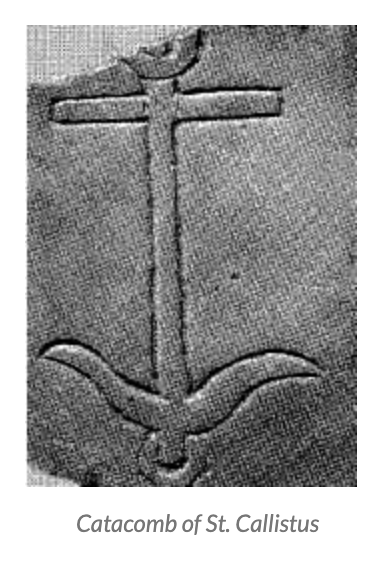

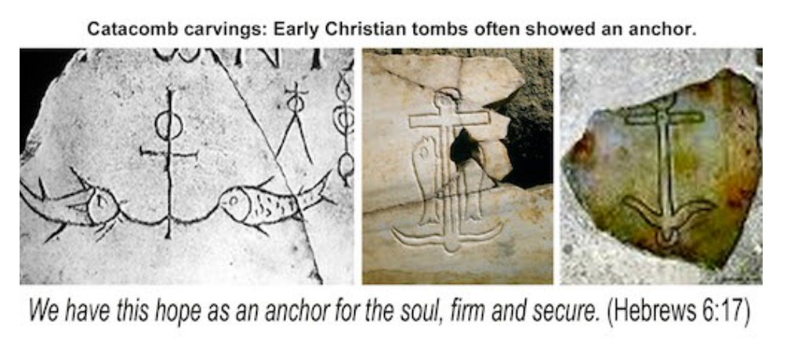

早期基督徒将锚与十字架巧妙结合，锚的形状本身就暗示着十字架，这样既能表达信仰，又不会在迫害时期引起注意。

### 船：教会的方舟

船在基督教中是教会最古老的象征之一：

**圣经基础：**

- **诺亚方舟**
    
    ：拯救义人脱离审判的洪水，预表教会拯救灵魂脱离罪恶
    
- **彼得的渔船**
    
    ：耶稣在船上讲道，呼召门徒，象征教会的使命
    
- **风暴中的门徒**
    
    ：耶稣平静风浪，象征教会在苦难中得到基督保护
    

**建筑体现**：早期基督教墓穴壁画中常见船的图案，教堂建筑术语"nave"（中殿）本身就来自拉丁文"navis"（船）。

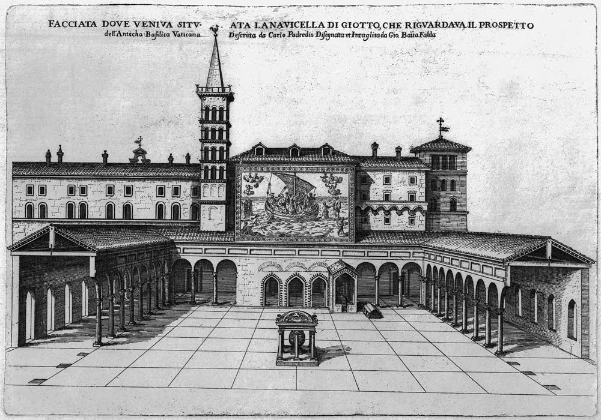

## 老圣彼得大教堂素描 可见当时的马赛克画作：小船

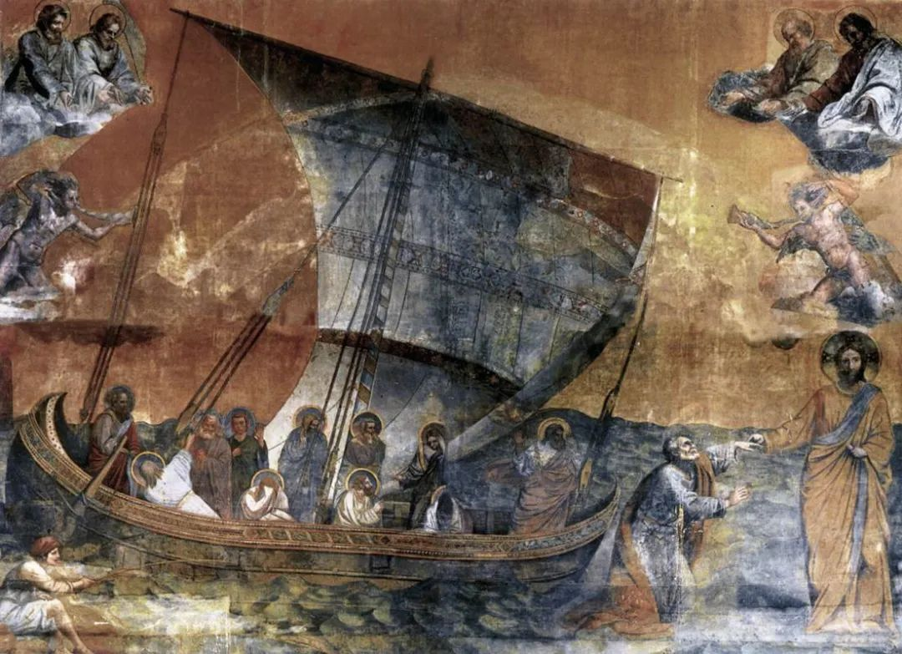

## 乔托 小船

乔托在14世纪初为老圣彼得大教堂创作的巨型马赛克《小船》（_Navicella_，意为“小船”），描绘了耶稣在加利利海面上行走、彼得试图走向耶稣的场景。这幅作品占据了教堂入口上方的整个墙面，船只巨大的风帆在暴风雨中鼓胀，成为“教会之船”隐喻的完美体现，其“船长”是圣彼得及其继任者——教宗。在天主教神学的解释中，这一图像凸显了使徒统绪（apostolic succession）的观念：教宗被视为彼得的合法继承人，承续了基督赐给彼得的“天国的钥匙”，因而在“捆绑与释放”（参《马太福音》16:18-19）上拥有独特的权柄，包括在赦罪与教会治理方面的最终裁量。

（注：“钥匙职”乃是赐给全体信徒的定罪和赦罪的职分，而不仅仅属于某一位继任者。）

## 百合花：纯洁的象征

严格说来，“百合花=纯洁”这个解释在圣经里并没有直接的经文支持，而是后来的教会传统与艺术发展出来的象征。：

**圣经中的百合花：**

- **马太福音 6:28-29**：耶稣用“野地的百合花”来说明上帝的供应，重点是**信靠上帝、不忧虑**，而不是“纯洁”。
    
- **雅歌 2:1-2**：百合花象征爱情的珍贵与独特，表达“新娘在万女中如百合在荆棘中”，强调的是**爱与美**。
    

## “纯洁”的象征是怎么来的？

- 在教父与中世纪灵修传统中，**玛利亚被解读为“纯洁之花”**。艺术家们便用“白百合”作为她童贞与圣洁的象征。
    
- 特别是在“天使报喜”的图像中，加百列几乎总是手持白百合，表达“玛利亚的无玷与顺服”。
    
- 文艺复兴艺术进一步强化了这种符号，使“百合=纯洁”的联想固定下来。
    

**在艺术中的表现：**

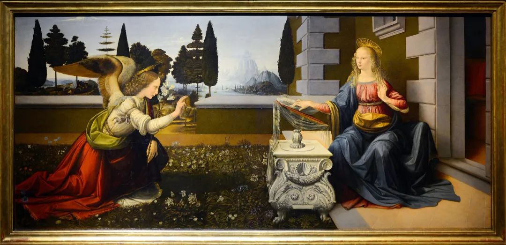

**天使报喜题材**：达·芬奇的《天使报喜》中，加百列天使手持白色百合花，象征玛利亚的纯洁。拉斐尔、波提切利等文艺复兴大师都在类似作品中使用了这一符号。

**象征意义：**

百合花的三片花瓣被解读为三位一体（圣父、圣子、圣灵）的象征。不同颜色的百合花有不同含义：

- **白百合**
    
    ：纯洁、童贞、圣母玛利亚
    
- **红百合**
    
    ：殉道者的血（但这种解释在艺术史中较少见）
    
- **黄百合**
    
    ：复活和荣光
    

## 蝴蝶：死亡与复活

蝴蝶的生命周期诠释了死亡到复活的过程：

**自然界的启示：**

毛虫（代表尘世的生命）→ 蛹（象征死亡与安息）→ 蝴蝶（复活的新生命）。这个蜕变过程在圣经真理中找到呼应：

**保罗的论述**（哥林多前书15:42-44）："死人复活也是这样：所种的是必朽坏的，复活的是不朽坏的...所种的是血气的身体，复活的是灵性的身体。"

**耶稣的比喻**（约翰福音12:24）："一粒麦子不落在地里死了，仍旧是一粒；若是死了，就结出许多子粒来。"

**在艺术中的表现：**

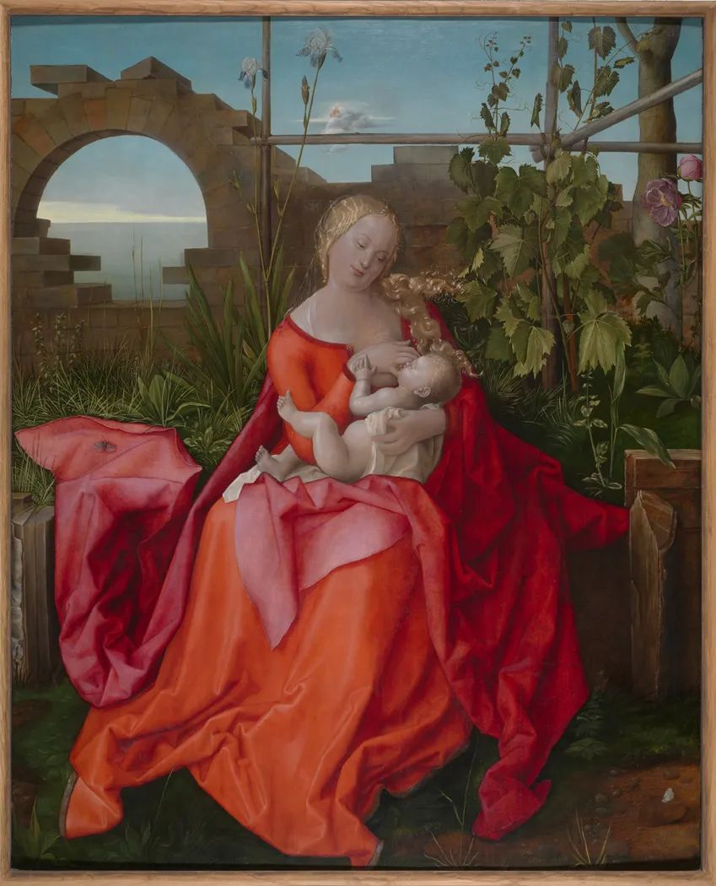

鸢尾花圣母

文艺复兴时期的画家常在圣母子画像中加入蝴蝶，暗示着基督未来的死亡与复活。例如在丢勒工坊的《鸢尾花圣母》中，蝴蝶栖息在圣母的斗篷上（斗篷尾部），象征着基督的复活。在墓园艺术和教堂装饰中，蝴蝶图案传达着永生的盼望，特别是在19世纪的象征主义绘画中较为常见。

### 羔羊：受难与救赎

羔羊是基督教中最重要的象征符号之一：

**旧约中的羔羊预表：**

**亚伯献祭**（创世记4:4）：亚伯"将他羊群中头生的和羊的脂油献上"，神看中亚伯和他的供物，建立了血祭蒙神悦纳的原则。

**亚伯拉罕献以撒**（创世记22:7-8）：当以撒问"燔祭的羊羔在哪里呢？"亚伯拉罕预言式地回答"神必自己预备作燔祭的羊羔"。

**逾越节羔羊**（出埃及记12:3-13）：每家要取无残疾的羊羔宰杀，将血涂在门楣上。"我一见这血，就越过你们去"—— 羔羊的血成为拯救的记号。

**赎罪日的祭牲**（利未记16章）：大祭司要为百姓的罪献上山羊，一只被杀献祭，一只成为"阿撒泻勒"（替罪羊）承担罪孽。

**以赛亚的受苦仆人预言**（以赛亚书53:7）："他被欺压，在受苦的时候却不开口；他像羊羔被牵到宰杀之地。"

**新约中的应验：**

施洗约翰的宣告（约翰福音1:29）："看哪，神的羔羊，除去世人罪孽的！"

启示录中的得胜羔羊（启示录5:6）：羔羊"像是被杀过的"，却站在宝座中，配得一切颂赞。

**艺术作品中的羔羊：**

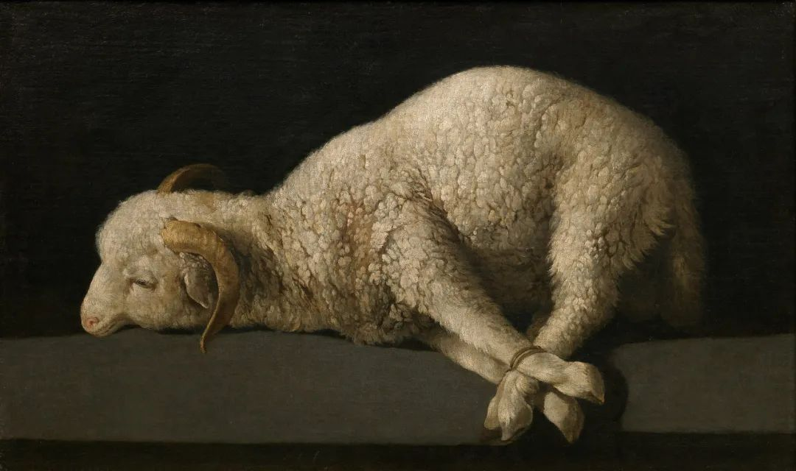

祖巴朗《神的羔羊》

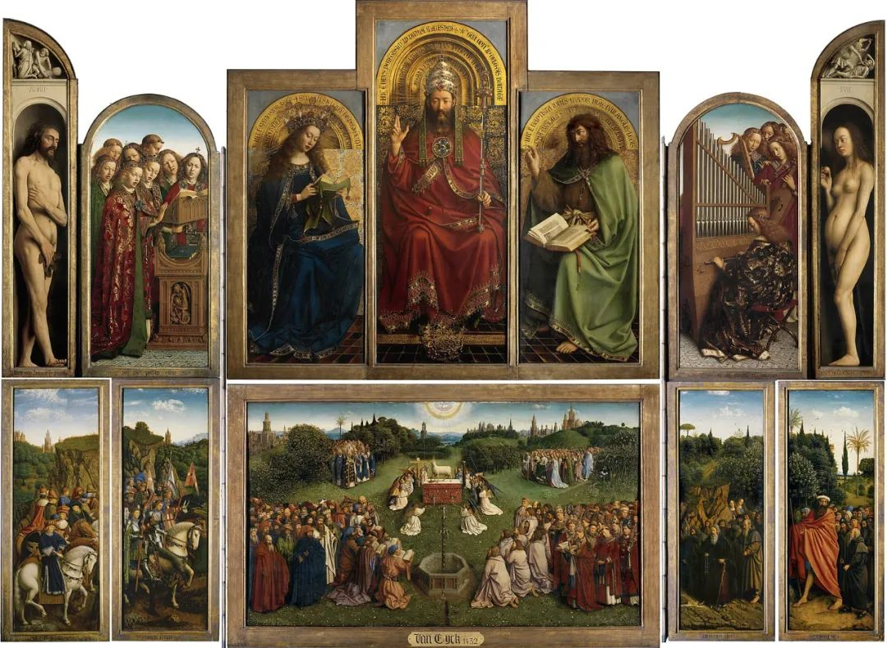

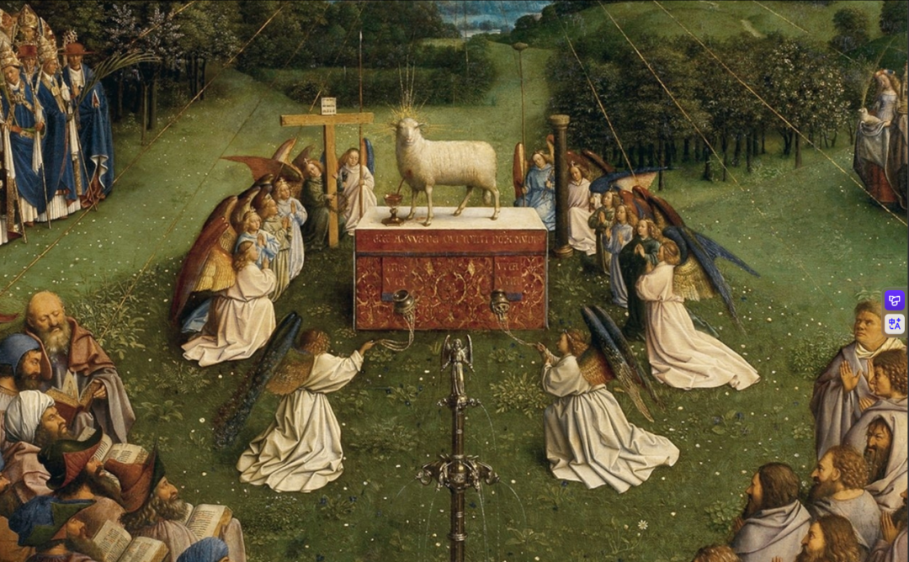

**范·艾克兄弟的《根特祭坛画》中央面板描绘了"神秘羔羊的崇拜"，羔羊站在祭坛上，周围是天使和圣徒，完美体现了启示录中羔羊的荣耀形象。在许多文艺复兴时期的圣母子画作中，幼年的施洗约翰常与小羊羔一起出现，预示着他将指认"神的羔羊"耶稣基督。**

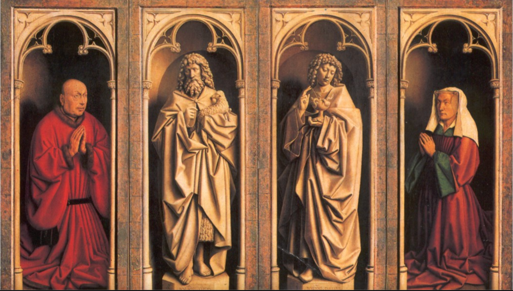

**《根特祭坛画》外翼面板中，施洗约翰左臂抱着一只羔羊，右手抬起并伸出食指指向羔羊，这个手势暗示他正在宣讲"Ecce Agnus Dei"（看哪，神的羔羊）**

**施洗约翰对面（右侧内翼面板）是圣约翰福音传道者（Saint John the Evangelist）。圣约翰手持一个装有毒蛇的圣杯。这个形象指涉一个早期传说，据说约翰曾经从一个有毒的杯子中饮用却幸存下来。圣杯指涉早期中世纪的传说，即具有治愈能力。**

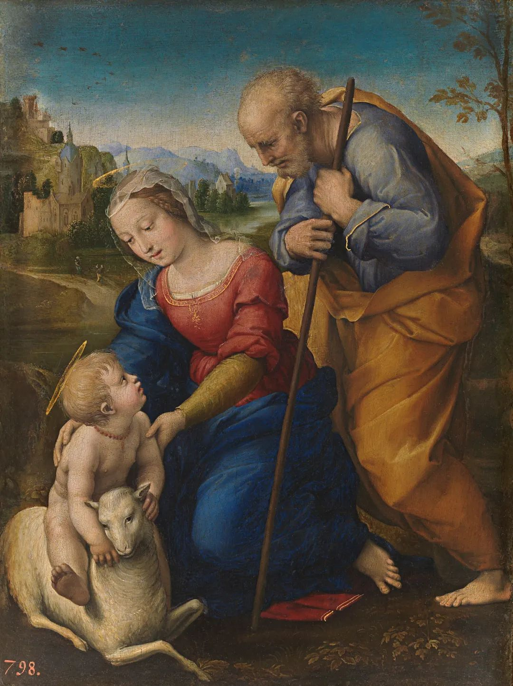

**拉斐尔的《圣家族与羔羊》（The Holy Family with a Lamb）**

****圣家族（**Holy Family）就是约瑟、玛丽亚和耶稣**

## 复活节彩蛋：新生命的庆典

复活节彩蛋的传统融合了古代春季庆典和基督教复活信仰。在基督教诠释中，蛋壳的破裂象征着耶稣基督冲破死亡的束缚获得重生，从封闭的墓穴中复活。

**颜色的象征意义：**

- **红色**
    
    ：基督为世人流下的宝血，也是最传统的复活节彩蛋颜色
    
- **白色**
    
    ：纯洁、新生和基督的神性
    
- **金色**
    
    ：荣耀、永恒和神圣光辉
    
- **绿色**
    
    ：春天的新生和希望
    
- **紫色**
    
    ：忏悔、君王身份和受难节
    

**各地传统的差异：**

在东正教传统中，红色彩蛋占主导地位，人们相互赠送时会说"基督复活了！"在希腊，人们用红色彩蛋相撞，破掉的一方要说"基督真的复活了！"西欧则发展出更多彩色装饰，德国的复活节彩蛋树、法国的巧克力彩蛋都成为了文化符号。

## 凤凰：复活的神话诠释

虽然凤凰并非圣经中的形象，但这种传说中浴火重生的神鸟被早期基督徒采纳，完美结合了火的炼净和复活重生两大圣经主题。

**关于火的炼净：**

**耶稣关于火的教导**（路加福音12:49）："我来要把火丢在地上，倘若已经着起来，不也是我所愿意的吗？"火象征着审判、洁净和属灵的变革。

**施洗约翰的预言**（马太福音3:11-12）："他要用圣灵与火给你们施洗...他要用火把糠秕烧尽。"火代表圣灵的洁净工作。

**保罗关于试炼的比喻**（哥林多前书3:12-13）："各人的工程必然显露，因为那日子要将它表明出来，有火发现，这火要试验各人的工程怎样。"

**玛拉基的预言**（玛拉基书3:2-3）："他如炼金之人的火...必洁净利未人，熬炼他们像金银一样。"

**关于复活重生：**

**耶稣的复活预言**（约翰福音2:19）："你们拆毁这殿，我三日内要再建立起来"，通过死亡获得新生。

**保罗的复活神学**（哥林多前书15:20-22）："基督已经从死里复活，成为睡了之人初熟的果子...在基督里众人也都要复活。"

**保罗关于新造的人**（哥林多后书5:17）："若有人在基督里，他就是新造的人，旧事已过，都变成新的了。"

**彼得关于新天新地**（彼得后书3:13）："我们照他的应许，盼望新天新地，有义居在其中。"

**凤凰象征的双重意义：**

凤凰的传说完美诠释了这两个主题的结合：旧的生命必须在火中消逝（炼净），新的生命才能从灰烬中诞生（重生）。早期教父们看到了这个深刻的相似性——正如基督通过受难的"火焰"（苦难与死亡）获得复活的荣耀新生命，信徒也要经历属灵的死亡与重生。

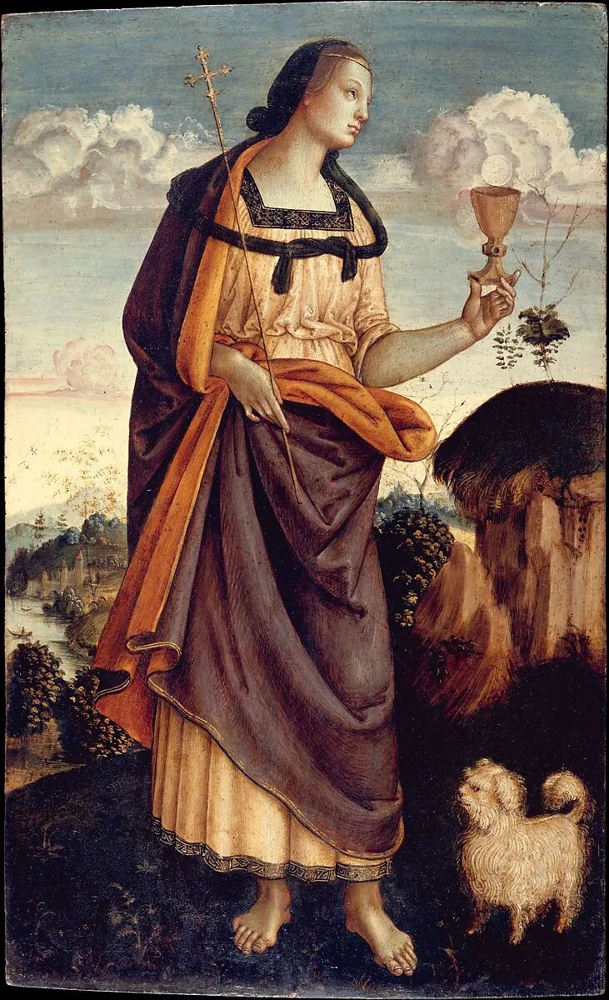

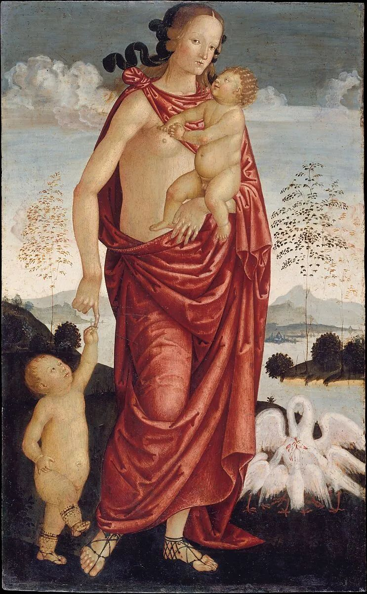

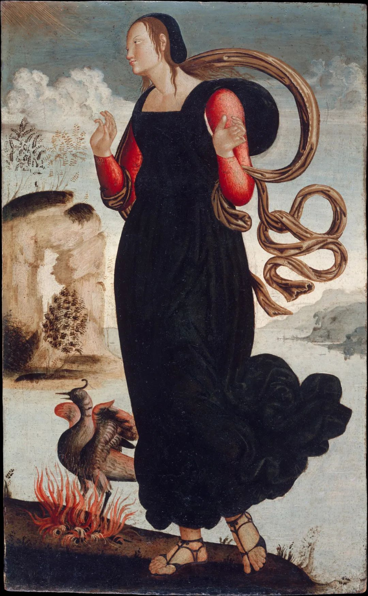

**作品描述：**这是一组三联画收藏于**纽约大都会艺术博物馆**，作者归属存在一些争议。每个人物都有一个属性：信（faith）脚下有一只狗，象征忠诚；爱（love）身后有一只鹈鹕，象征基督的牺牲；望（hope）脚下有一只凤凰，象征基督的复活 。

在"希望"（Hope）这一面板中，凤凰作为基督复活的核心象征出现，这是基督教艺术中凤凰形象的经典表现。这组画作原本可能是用来装饰高背长椅的靠背或房间的护墙板。

（鹈鹕为什么象征爱？**传说**：在古代传说中，鹈鹕被认为会用自己的喙刺破胸膛，用鲜血喂养幼鸟。这个故事虽然并非事实，但象征了无私的父母之爱和自我牺牲的精神。）

### 棕榈枝：胜利者的荣冠

棕榈枝在基督教中是胜利和荣耀的象征：

圣经根据：

- **棕榈主日**
    
    ：耶稣骑驴进入耶路撒冷时，众人"拿着棕树枝出去迎接他"（约翰福音12:13）
    
- **启示录7:9**
    
    ：天上的得胜者"手拿棕树枝，站在宝座和羔羊面前"
    

在罗马文化中，棕榈枝本就是胜利象征，基督教继承并赋予其属灵意义——胜过死亡、罪恶和撒但的最终胜利。

权柄与永恒

### 钥匙：天国的权柄

钥匙是彼得和教会权威的标志：

**圣经出处：**马太福音16:19，耶稣对彼得说："我要把天国的钥匙给你，凡你在地上所捆绑的，在天上也要捆绑；凡你在地上所释放的，在天上也要释放。"

**象征应用：**钥匙成为教宗权威的象征，梵蒂冈国旗上交叉的金银两把钥匙正源于此。圣彼得在艺术作品中常手持钥匙，如**佩鲁吉诺 (Pietro Perugino)**西斯廷教堂壁画《交付钥匙》。

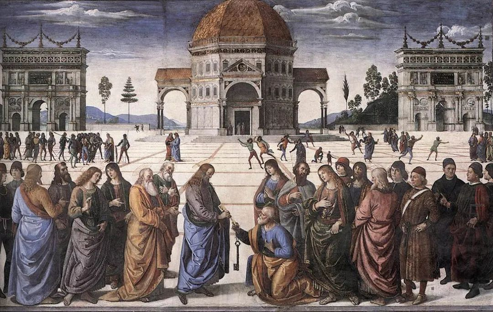

**佩鲁吉诺 (Pietro Perugino)**西斯廷教堂壁画《交付钥匙》

## **天主教 vs 路德宗对"钥匙职"的不同理解：**

### **天主教观点：**

- **专属权威**
    
    ：耶稣专门将"天国钥匙"给了彼得个人（《马太福音》16:19）
    
- **使徒继承**
    
    ：这权威通过彼得传给罗马主教（教宗）的继承者们
    
- **等级制度**
    
    ：通过教宗和主教的等级制行使权威
    

### **路德宗观点：**

- **集体权威**
    
    ：耶稣将同样权力给了所有使徒（《马太福音》18:18）
    
- **信徒皆祭司**
    
    ：钥匙职属于全体教会和每个信徒
    
- **地方自治**
    
    ：通过地方会众选立的牧师公开行使，无需教宗权威
    

### **核心分歧：**

**天主教**认为钥匙是彼得个人及其继承者的专属权威；**路德宗**认为钥匙是全体教会的集体权威。

这就是为什么梵蒂冈国旗有交叉钥匙（象征教宗权威），而路德宗强调地方会众自治。

### 太阳：公义的光辉

圣经依据：

- 玛拉基书4:2："公义的日头要为你们而出现，其光线有医治之能"
    
- 约翰福音8:12：耶稣说"我是世界的光，跟从我的，就不在黑暗里走"
    
- 启示录21:23："那城内又不用日月光照，因有神的荣耀光照，又有羔羊为城的灯"
    

从早期基督教马赛克到文艺复兴绘画，基督常被描绘为发光的形象，头部环绕光环，有时整个身体都散发金光。

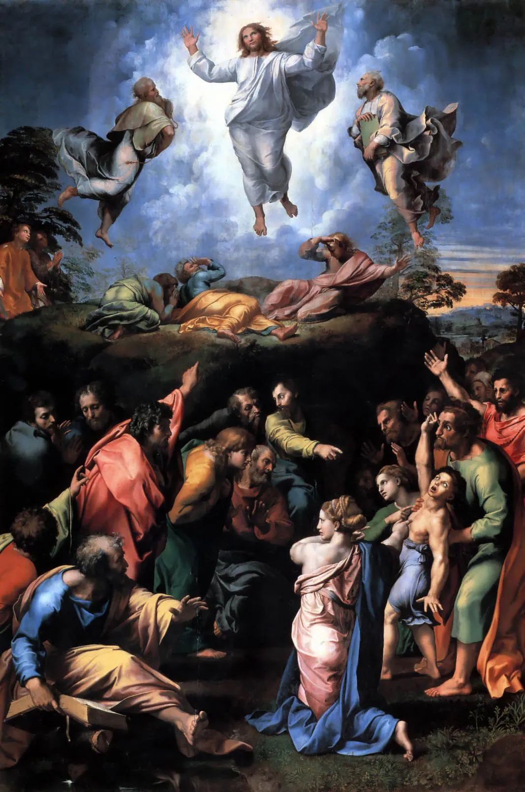

拉斐尔《变像》

拉斐尔的《变像》虽然没有直接绘制太阳，但通过耶稣"面貌如太阳发光"的描绘，以及画面中从基督身上散发的眩目光芒，完美地体现了基督作为"公义日头"的象征。这种光辉不仅是视觉效果，更是神学象征——基督作为世界之光，驱散黑暗，带来救赎。

### 八角星：新造的荣耀

八角星在基督教中具有独特的神学意义：

**数字八的象征：**在基督教传统中，七代表完全（创世七日），而八象征**新的开始**和**重生**。耶稣在"第八日"（一周的第一日，星期日）复活，因此八成为复活和永生的数字。

**多重含义：**

- **重生与新造**
    
    ：八个角代表超越七日创世的新创造
    
- **伯利恒之星**
    
    ：指引博士寻找圣婴，八角形强调其神圣性质
    
- **复活的荣光**
    
    ：八个光芒象征基督复活带来的永恒光明
    
- **八福**
    
    ：对应耶稣在山上宝训中宣告的八个福分
    

许多古老教堂的洗礼池建成八角形，象征受洗者的重生。拉文纳的圣维塔教堂等拜占庭建筑大量采用八角形设计。

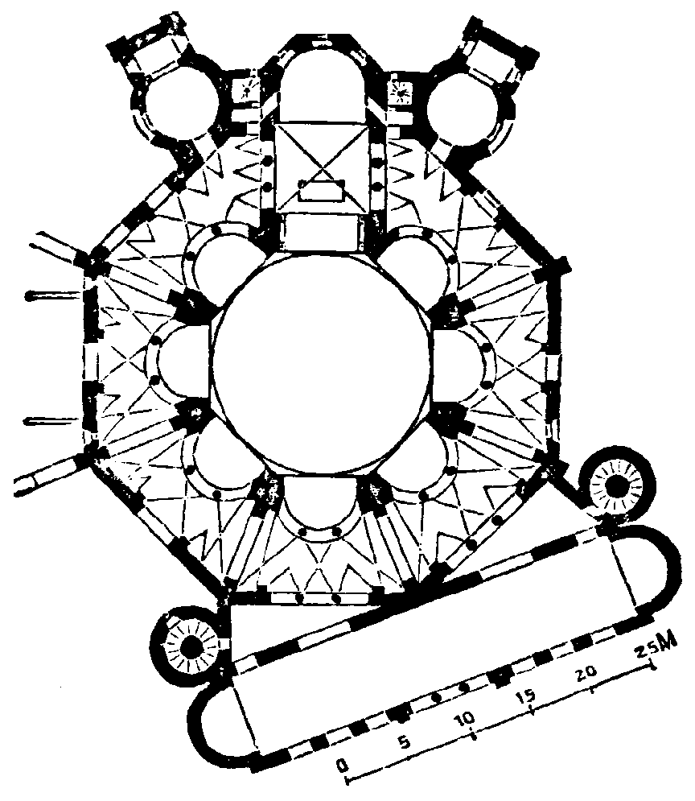

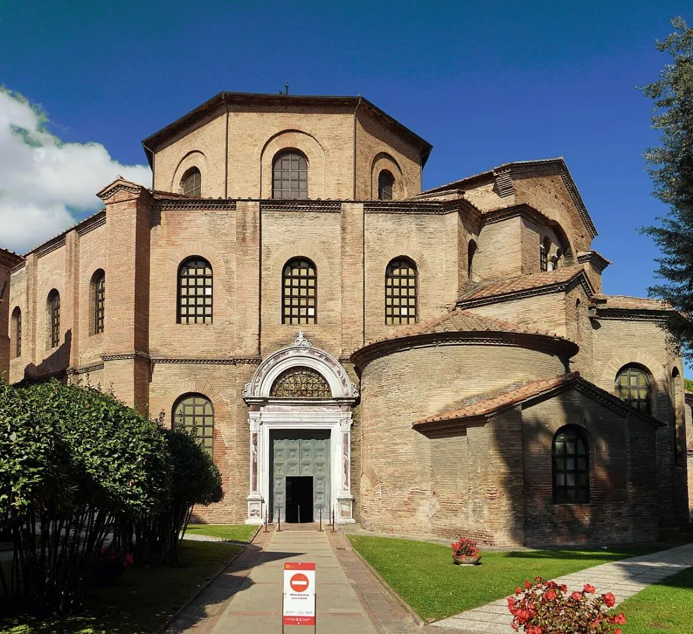

拉文纳的圣维塔教堂

## 鸽子：和平与圣灵的使者

鸽子在基督教中承载着丰富的圣经意义：

**旧约中的象征：**

**诺亚方舟**（创世记8:8-12）：洪水后，诺亚放出鸽子探查水势，鸽子口含橄榄叶归来，预示着神的愤怒平息，和平重新降临大地。从此鸽子成为和平、希望与新开始的象征。

**雅歌中的比喻**（雅歌2:14）："我的鸽子啊，你在磐石穴中，在陡岩的隐密处，求你容我得见你的面貌，得听你的声音。"鸽子代表纯洁的爱与忠诚。

**新约中的显现：**

**耶稣受洗**（马太福音3:16）：耶稣受洗时，"神的灵仿佛鸽子降下，落在他身上"，鸽子成为圣灵的可见象征。

**五旬节**（使徒行传2章）：虽然圣经描述圣灵如"舌头如火焰"降下，但传统艺术常用鸽子来表现圣灵的降临。

**艺术作品中的鸽子：**

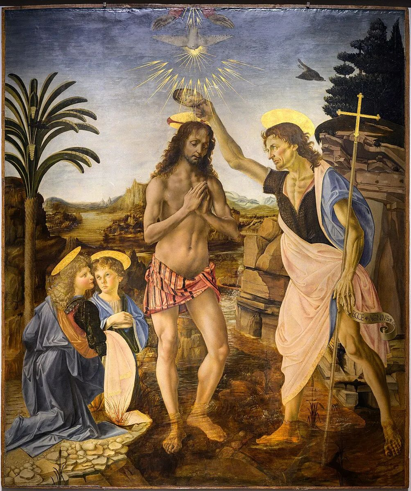

**韦罗基奥与达·芬奇《耶稣受洗》（约1475年）**：这幅现藏于佛罗伦萨乌菲齐美术馆的名作中，"耶稣头顶上方，天开了，有圣父的手，有鸽子（圣灵）落下来。圣父圣子圣灵在图中心构成一条直线"。

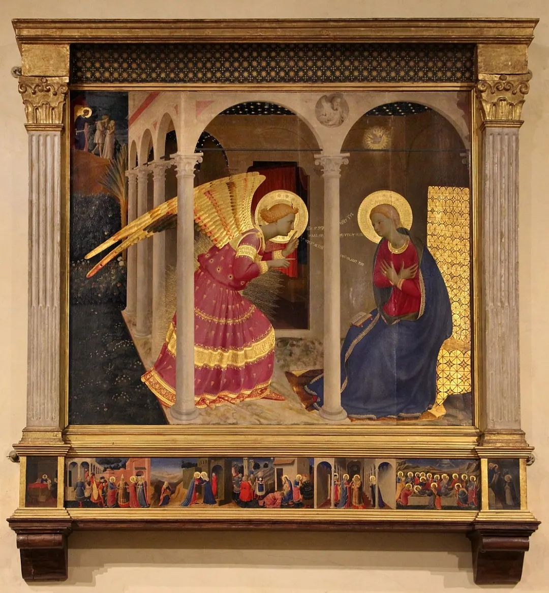

**天使报喜题材**：在许多天使报喜的画作中，圣灵以鸽子的形式出现。例如弗拉·安吉利科的《天使报喜》（1433-1434年，现藏科尔托纳教区博物馆）中，"她十分端庄，头上有只鸽子（代表三位一体里的圣灵）在金色的光中飞舞"，象征着圣灵降临使玛利亚受孕。这一传统在许多文艺复兴时期的天使报喜作品中都有体现。

**三位一体主题画作**：在描绘圣父、圣子、圣灵的画作中，鸽子几乎是圣灵的标准表现形式，从中世纪到文艺复兴都有大量作品采用这一图像。

天主教耶稣圣心

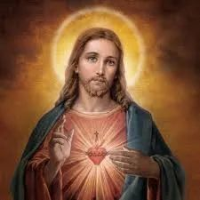

耶稣圣心（Sacred Heart of Jesus）是天主教最重要的敬礼对象之一，通常描绘为燃烧着火焰的心脏，外围荆棘冠冕，顶部有十字架，象征着耶稣对人类无限的爱与怜悯。这个形象强调基督的人性，特别是他为拯救世人而承受的痛苦和牺牲之爱。

圣心敬礼的现代发展主要源于17世纪法国修女圣玛加利大·玛丽·阿拉科克（Saint Margaret Mary Alacoque）的神视经历。据记载，耶稣多次向她显现，要求建立圣心敬礼，并承诺给予特殊恩宠。1856年，教宗庇护九世正式确立了圣心节，定于耶稣圣体节后的第三个星期五庆祝。

圣心图像的象征意义极为丰富：燃烧的火焰代表神圣之爱的热忱，荆棘冠冕提醒人们基督的受难，十字架彰显救赎的完成，有时还会加上光芒四射的效果，象征神性光辉。许多天主教家庭会在家中供奉圣心像，相信这能为家庭带来保护和祝福。这一传统深深植根于天主教的灵修传统中（以视觉形象辅助，默想神牺牲的爱），成为信徒表达对基督深情敬爱的重要方式。

路德玫瑰：新教改革的精神象征

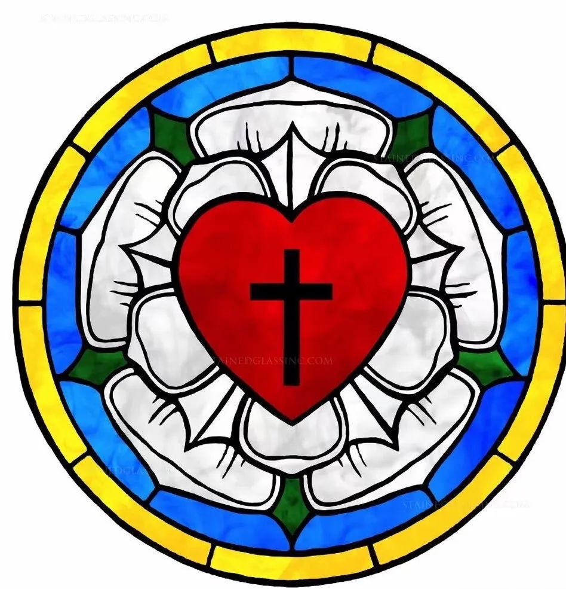

- 路德玫瑰（Luther Rose）是1530年在萨克森选帝侯约翰·弗里德里希的委托下为马丁·路德创制的纹章，路德亲自参与了设计过程并为其赋予了神学含义。路德玫瑰由五个同心元素构成：最中心的黑色十字架象征基督受难，置于红色心形之上代表因信称义的重生之心，白玫瑰环绕象征圣灵带来的喜乐与平安，蓝色圆环代表天堂的永恒盼望，金色底色则象征天国荣耀。
    
    路德在1530年的信件中解释：这个设计将改革宗神学的核心——唯独信心、唯独恩典、唯独基督——融入视觉符号。路德玫瑰成为新教传统中的重要宗教标识，与天主教圣心、东正教三臂十字架并列，今天仍装饰着世界各地的路德宗教堂，提醒信徒回归福音的纯粹与简朴。
    

## 现代影视中的基督形象延续

这些基督教符号不仅在宗教语境中具有意义，也深刻影响了西方乃至世界文化。从文学作品到建筑设计，从艺术创作到日常用品，这些符号承载的文化内涵早已超越了宗教范畴，成为人类文明的共同财富。

传统基督教符号的精神内核在现代流行文化中得到了延续。

**超人**作为最经典的例子，从天而降拯救世界，在《超人：钢铁之躯》中直接采用十字架受难姿态。

**《指环王》中的甘道****夫**在摩瑞亚矿坑"死亡"后以白袍甘道夫身份复活，明显呼应了死亡与复活的主题。**《指环王》中的**三重弥赛亚象征：先知（甘道夫）、祭司（弗罗多）和君王（阿拉贡）

**《黑客帝国》中的尼奥**被明确设定为"救世主"，通过死亡与复活拯救人类。

迪士尼的Baymax（大白）以自我牺牲的爱治愈他人，最终"复活"回归。（这个属于个人理解，不一定是作者意图）

这些现代作品延续了古老基督教符号的核心价值——牺牲的爱、死亡与重生、拯救与救赎——证明了这些符号所承载的普世精神在当代依然以新的艺术形式感动着观众，超越了宗教界限成为人类共同的文化符号。

您还想到哪些圣经相关的符号和象征，欢迎留言补充。

---------------

十字架部分图案和思路借鉴了网站即食历史--【神秘的符號】極富歷史和宗教意義的基督教十字符號－耶路撒冷十字

https://cuphistory.net/the-jerusalem-cross/

[默想合集](https://mp.weixin.qq.com/mp/appmsgalbum?__biz=MzIwODAyNjAzNg==&action=getalbum&album_id=4117444747667701769#wechat_redirect)

[讲道集](https://mp.weixin.qq.com/mp/appmsgalbum?__biz=MzIwODAyNjAzNg==&action=getalbum&album_id=4117454178509914116#wechat_redirect)

[诗篇默想](https://mp.weixin.qq.com/mp/appmsgalbum?__biz=MzIwODAyNjAzNg==&action=getalbum&album_id=4117757251232989187#wechat_redirect)

[教义系列](https://mp.weixin.qq.com/mp/appmsgalbum?__biz=MzIwODAyNjAzNg==&action=getalbum&album_id=4120335088305569800#wechat_redirect)

[律法福音](https://mp.weixin.qq.com/mp/appmsgalbum?__biz=MzIwODAyNjAzNg==&action=getalbum&album_id=4118075361592868867#wechat_redirect)

[信仰生活](https://mp.weixin.qq.com/mp/appmsgalbum?__biz=MzIwODAyNjAzNg==&action=getalbum&album_id=4125060036488069121#wechat_redirect)