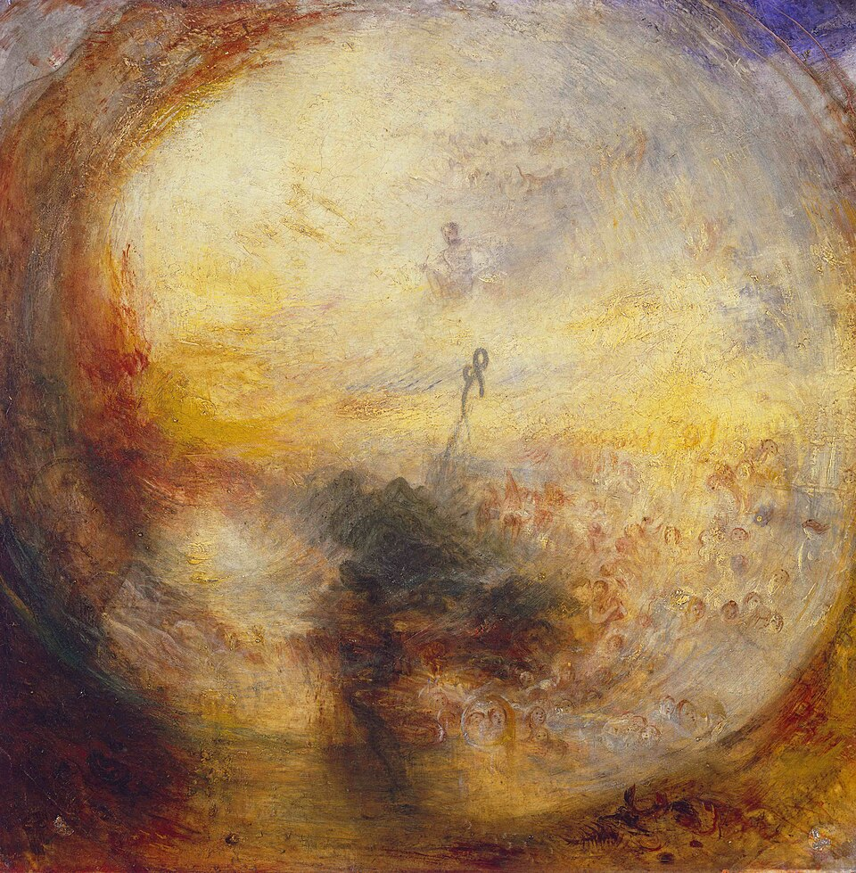

英国浪漫主义大师透纳于1843年创作的《洪水过后的清晨》（现藏于伦敦泰特美术馆）。
约瑟夫·玛罗德·威廉·透纳（J.M.W. Turner）

它的全名非常冗长，包含了科学与宗教隐喻：《光与色（歌德理论）——洪水过后的清晨——摩西写作创世记》（Light and Colour (Goethe's Theory) – The Morning after the Deluge – Moses Writing the Book of Genesis）。

这幅画有几个很特别的看点：科学与艺术的跨界：画作的官方全名里包含“歌德理论”。当时物理学家牛顿主张“色彩是纯粹的物理现象”（通过三棱镜实验证明白光由七彩光谱组成，颜色是客观存在的物理属性）。而德国文豪歌德对此持反对意见，认为颜色是光与暗相互作用产生的心理和精神体验。透纳非常赞同歌德，于是在画中大量使用金色和橙色等暖色调，试图用艺术实验来证明“色彩能直接引发人类的情感共鸣”。

时空交错的戏剧性：从历史逻辑来看，这幅画存在有趣的“时空穿越”。（或者说图像/画面的重叠，其实圣典经常使用这种创作手法，比如联系个人洁净之礼和洪水的关系彼得前书3:21）经历大洪水的是诺亚，而画面正中央金光里隐约可见的模糊身影，却是几百年后撰写《创世记》的摩西。透纳故意将两人重叠在同一个时空，是为了表现人类历史在洪水洁净之礼后重新开始的宏大叙事。

隐蔽的画面细节：画面采用了在当时很罕见的正方形漩涡状构图。如果仔细观察漩涡的边缘和下方，会发现一些隐约的圆形轮廓，它们像气泡一样，其实象征着在大洪水中被吞噬的生命与经历审判的怨魂。

这幅画在19世纪因为过于前卫、缺乏清晰线条而遭到保守评论家的批评。但如今，它将自然力量与纯粹光影融合的表现手法，被公认为现代抽象艺术的先驱之作。

透纳在画面正中央金光最刺眼的漩涡中心，画了一根隐约的杆子，上面缠绕着一根线条——那正是几百年后摩西在旷野中举起的“铜蛇”；而摩西本人则坐在铜蛇后方的金光深处写作。

参考约翰好消息3:11-18，我们非常熟悉3:16，但是可能常常忽略3:16挂着一个远古的救赎图画，就是摩西在旷野举蛇的医治。

出处：《旧圣典·民数记》第21章第4节至第9节（Numbers 21:4-9）。背景故事：以色列人在旷野漂流时，因为路途艰难而向至高者和摩西发怨言。至高者便使火蛇进入百姓中间，咬死了许多人。百姓醒悟并认罪，求摩西祈求。至高者于是指示摩西：“制造一条火蛇，挂在杆子上；凡被咬的，一望这蛇，就必得活。” 摩西便制造了一条铜蛇挂在杆子上，凡被蛇咬的人，只要一望这只铜蛇，就真的活了下来。

画面下半部的黑色并非方舟，而是用黑色表达死亡和魔鬼的阴霾。

透纳研究“歌德色彩学”，歌德认为世界是光与暗相互冲突的。上方夺目的金黄色、橙色是至高者的“圣光”，代表救赎与希望；而底部的黑色、深褐色则是“黑暗与恶行”的残余。虽然大洪水过去了，但人类体内的原罪（魔鬼的诱惑）并没有完全消失。下方的黑暗阴影预示着，在未来的历史中，人类依然要在圣光（至高者）与黑暗（恶行/魔鬼）之间不断挣扎。

上方与中心：摩西在举起象征救赎的铜蛇，散发着金光，直通至高者的国度。下方：是那些如同被毒蛇（魔鬼的化身）咬死一般的、在黑暗洪水中沉沦的冒犯者。仰望中心的人得救，而沉溺在底部黑色阴影里的人灭亡。

所以这幅以方舟为主题的画面，并没有方舟，方舟只出现在标题里。方舟就是另一个伊诶溯斯/会众的象征。（受差遣者信经第三段，我信圣而公之会众，圣徒相通，罪得赦免……）

铜蛇的杆子插在死亡之上，这个构图很妙。伊诶溯斯的死亡和从死里升起，大洪水中的死亡和存活（方舟被 raised up），铜蛇故事的死亡和医治都在这个结构中同构了。

在LSB（Lutheran Service Book 路德宗会众聚集书）里有这样一个洪水的祈求（Flood Prayer）作为施行洁净之礼时的祝福祈求（写得真好）：

Almighty and eternal God, according to Your strict judgment You condemned the unbelieving world through the flood, yet according to Your great mercy You preserved believing Noah and his family, eight souls in all. You drowned hard-hearted Pharaoh and all his host in the Red Sea, yet led Your people Israel through the water on dry ground, prefiguring this washing of Your Holy Baptism. Through the Baptism in the Jordan of Your beloved Son, our Lord Jesus Christ, You sanctified and instituted all waters to be a blessed flood, and a lavish washing away of sin. We pray that You would behold (name) according to Your boundless mercy and bless him with true faith by the Holy Spirit that through this saving flood all sin in him which has been inherited from Adam and which he himself has committed since would be drowned and die. Grant that he be kept safe and secure in the holy ark of the Christian Church, being separated from the multitude of unbelievers and serving Your name at all times with a fervent spirit and a joyful hope, so that, with all believers in Your promise, he would be declared worthy of eternal life, through Jesus Christ, our Lord.

全能永在的至高者，祢曾照着祢严厉的审判，用大洪水毁灭了不信的世界；却又照着祢极大的怜悯，保全了信心的诺亚及其全家共八口人。祢曾使刚硬的法老及其全军淹死在红海之中，却引领祢的子民以色列人走干地穿过圣水，以此预表了这神圣洁净礼礼的洗涤。借着祢爱子——我们的主伊诶溯斯受膏者在约旦河受洁净之礼，祢使这水成圣并设立洁净之礼，使其成为带来祝福的洪流，丰盛地洗净人的罪愆。我们恳求祢，因着祢无边无际的怜悯垂顾（受洁净之礼者姓名），赐他神圣之灵与无伪的信心，使他借着这得救的洪流，将从亚当遗传的所有罪性以及他自己后来所犯的一切恶行，尽都淹没并死葬。求祢使他在受膏者信仰会的圣方舟内蒙保守，安稳无虞；与不信的世人分别开来，常存火热的心与喜乐的盼望来事奉祢的名；以致他能与所有相信祢应许的人一同被看为配得永生。这都是靠着我们的主伊诶溯斯受膏者。愿如此。

