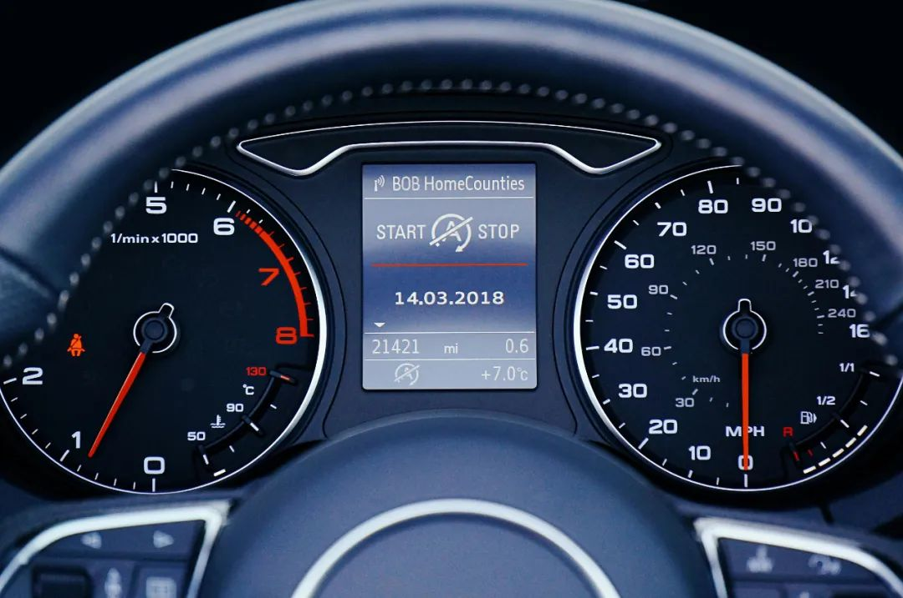

# Identifying Idols in Our Lives: Reflecting on Priorities Through Our Stewardship Identity

The first commandment "You shall have no other gods before me" warns us against the hidden idols in the depths of our hearts. In contemporary Christian life, we rarely bow down to golden or silver statues, but various invisible idols may silently occupy the throne of our hearts.

## Stewardship Identity: Redefining Our Relationship with the World

Everything we possess—health, abilities, time, wealth—does not truly belong to us, but are resources entrusted to us by God for management. Recognizing this means our fundamental identity on earth is that of stewards, not owners.

This identity awareness affects how we view our lives. God grants us healthy bodies and various gifts, enabling us to work and transform time into money. From this perspective, time and money are essentially similar—both manifestations of God's grace that require our faithful stewardship.

## Time and Money: Indicators of Life's Priorities

An effective way to identify idols in our lives is to examine how we allocate our time and money. Our true "gods" are often hidden in our priorities.

When we find ourselves investing the vast majority of our time and money in one particular thing, we might honestly ask ourselves: Has this thing's position in my heart exceeded its proper place? Am I managing these resources according to God's will, or am I serving my own idols?

There are two distinctly different mindsets here:

**Steward mindset**: I am God's steward, faithfully managing the resources and work entrusted to me.
**Owner mindset**: My gifts, abilities, time, and money are all for achieving my personal life pursuits.

This mindset difference determines the essence of our relationship with the world. The first commandment reminds us: "You shall have no other gods before me." We should daily examine our lives through this law, confess to God, and accept the gospel of Jesus Christ's forgiveness.

## Life's Brevity and Eternal Perspective

"We brought nothing into the world, and we can take nothing out of it"—this reminds us that we cannot truly own anything earthly. Our days on earth are like mist that appears briefly and then vanishes, while we will dwell with the Lord in paradise. This eternal perspective helps us reassess what is truly important.

When we remember we are only temporary stewards, when we remember all earthly things will pass away, it becomes easier to identify the idols in our lives. Work achievements, relationships, material pleasures, even our families and children—these are all good things, blessings from God.

But when they become the entire meaning of our lives, when we forget our stewardship identity and begin to cling like owners, when we cannot accept our position as creatures in certain matters and want to reign and rule for "everything to go our way," they become our idols.

## God's Heart: His True Treasures

Through the first commandment, God is not trying to snatch away our "treasures," but rather He wants to obtain His treasures—our eternal souls.

To God, our worldly "treasures" are gifts He has given us for this life, but what He values more is us as people. He loves us and was willing to sell everything to buy us back.

Jesus' parables of the kingdom in Matthew 13:44-50, along with Paul's teaching in 2 Corinthians, all reveal the same truth: "For you know the grace of our Lord Jesus Christ, that though he was rich, yet for your sake he became poor, so that you through his poverty might become rich." (2 Corinthians 8:9)

> "The kingdom of heaven is like treasure hidden in a field. When a man found it, he hid it again, and then in his joy went and sold all he had and bought that field. Again, the kingdom of heaven is like a merchant looking for fine pearls. When he found one of great value, he went away and sold everything he had and bought it..."

Christ sold everything in heaven to buy us back—these pearls of great price. When we truly understand this grace, stewardship is no longer a burden, but a grateful response. Our identity before God—children redeemed at great cost—becomes the fundamental motivation for faithfully managing His gifts.

God values us and spared no cost to obtain us. He desires all to be saved and does not want anyone to perish. He uses the first commandment to protect us from falling into the evil one's hands and being thrown into the furnace at the end of the world.

If our wealth, status, work, even family and children become idols, rather than clinging to them and entering hell, it's better to let them go, accept God's costly redemption, and gain eternal life.

## Practical Exercise: Identifying Heart Idols

Try this quiet reflection exercise:

1. Write down all the precious things in your life on pieces of paper—health, family, work, dreams, wealth, children, reputation, Bible, church, God, etc.
2. Imagine having to give them up one by one, starting with the relatively less important ones.
3. When you find something that makes you feel "absolutely cannot lose" fear, when you feel life would lose meaning without it, you may have found an idol in your heart.

During this process, remind yourself: These don't truly belong to me; they are all entrusted to me by God for management. Does my attachment to them exceed my reverence for the true Owner?

## Continued Vigilance: The Daily Practice of Idol Identification

Identifying idols is not a one-time task but requires continuous vigilance. The human heart is changeable; today's idol may be replaced by new attachments tomorrow.

The key is developing sensitivity, constantly examining ourselves from our stewardship identity:

- Am I using these resources according to the Master's will?
- What is demanding loyalty that exceeds my stewardship duties?
- What do my time and money allocation patterns reflect about my inner values?

Only when we remember our stewardship identity and view temporary earthly things with an eternal perspective can we stay alert on our faith journey and let the true Master truly reign on the throne of our hearts.

Checking our life's priority dashboard

## Grace-Driven Stewardship Life

True stewardship stems from grace. When we deeply experience that Christ became poor for us, our giving and management no longer come from pressure or obligation, not I have to, but I want to. This is "faith in action"—because we understand our blessed identity before God, we willingly manage what He has entrusted to us.

Understanding our position before God—not as debtors, but as beloved children—this identity awareness transforms the entire motivational structure of our stewardship. As Pastor Josh said, the motivation behind stewardship should be understanding our status before God.

## Redefining "Giving": The Broader Application of Stewardship

In many churches, "giving" is often narrowly understood as monetary donations to the church. However, from a stewardship perspective, giving can have a much broader meaning.

Dr. Wei once shared his personal view: he considers all family resources not spent on himself and his children as giving—including both to the church and to others. This definition stems from one principle: God entrusts us with gifts and resources so we can love God and love our neighbors.

Therefore, all time and money used to serve others rather than satisfy ourselves is essentially giving.

God gives each family and individual unique circumstances and perspectives, enabling us to see various needs around us: aging parents, friends in difficulty, brothers and sisters in the church, neighbors in the community. Supporting ministries that proclaim God's word is certainly important, but responding to these specific needs around us is equally giving.

This understanding provides us with a practical life assessment tool: regularly examine our time and money allocation—how much for ourselves, how much for others? This simple ratio reflects our true inner value orientation and reminds us whether we are faithfully fulfilling our stewardship duties.

---

_May we all maintain vigilance in daily life, faithfully managing everything God has entrusted to us as stewards, letting Him truly reign in our hearts. When we truly understand Christ's grace—that though He was rich, yet for our sake He became poor—our stewardship life becomes a grateful response, an act of faith._

_Acknowledgments: Thanks to Pastor Josh Koelpin and Professor Paul Koelpin for their Luke sermon series, particularly their multiple sermons on chapter 12 that prompted me to write this article. Thanks to Pastor Josh for his discussions and guidance on identifying life's idols. Special thanks to Pastor Josh for reviewing this article and his revision suggestions. His insights about "stewardship being faith in action" and the 2 Corinthians 8:9 passage helped articulate more clearly the identity and duties of stewardship from God's perspective of love._